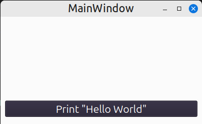
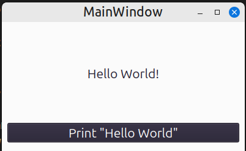

# helloWorld
When you click on the button, 
print text "Hello world!".

---

## Development cycle
### Define the problem to solve
The main question: what problem do i want to solve?

Write a simple application whith a graphical interface
to understand the principles of development. 

### Setting requirements
The main question: how will I solve the problem?
The result of the development is an executable application 
with graphical interface. 

The solution include:
- One form.
- Button at the bottom of the form, with the text «Print "Hello World"».
- Label, with printe text "Hello World!" in center of the form.

### Write a program that implements the solution
The main logic of the program is located in the function 
``void MainWindow::on_pb_print_released()`` from file MainWindow.cpp

When you click on button ``pb_print``, the text appears in the label ``printedText``. 

### Testing
Result — 
Smok
Unit 
Vivod соответствует тех.требованиям и реализации
<picture>
   
</picture>

<picture>
   
</picture>
